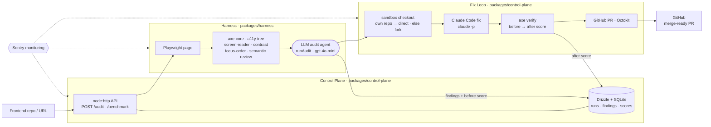

# Ramp

**Accessibility audit → fix → PR. axe detects; Ramp understands and fixes.**

Lighthouse and axe-core *find* WCAG violations and stop at a report. Ramp closes the loop:
it audits a real rendered page, reasons about the WCAG criterion, **writes the fix, verifies
it with axe-core, and opens a merge-ready pull request** — and it catches semantic issues axe
is blind to (alt text that just says `"image"`, links that say `"click here"`).

> **axe: 0 violations · Ramp: 12 semantic issues axe can't see** (across 3 demo pages).
>
> **Detection that depends on rendering:** on pages whose contrast lives in external CSS,
> the harness catches **92%** of violations vs **40%** reading source only. Across all
> html-live pages: **84.5%** recall (harness) vs **69.0%** (naked) — 3-run average, gpt-4o-mini.

---

## Three pillars

| Pillar | Package | What it does |
|---|---|---|
| **A11y-Bench** | `packages/bench` | 51 ground-truth tasks mined from real merged a11y PRs + 10 fully-annotated fixtures; scores **naked LLM vs harness** on recall **and** precision, split by `html-live` / `source-code`. |
| **Harness** | `packages/harness` | Drives a headless page through Playwright + axe-core + accessibility tree + screen-reader simulation + contrast/focus inspectors + **semantic review**; an LLM agent reasons over the evidence (`runAudit`). |
| **Auto-fix loop** | `packages/control-plane` | sandbox checkout → audit → **Claude Code** fix → **axe verify (before/after score)** → **GitHub PR**. Sentry monitors every step. |

## Real fix PRs (verified, before → after)

| Repo | Fix | Score | PR |
|---|---|---|---|
| `bad.html` (fixture) | alt + contrast + button names + `<main>` | **60 → 96** | [Ramp#7](https://github.com/yangzhang75/Ramp/pull/7) |
| semantic (fixture) | meaningless alt/link/button names axe passes | semantic 5 → 0 | [Ramp#10](https://github.com/yangzhang75/Ramp/pull/10) |
| `aigov-ops…` (real OSS) | missing `<main>` landmark | **92 → 100** | [PR#1](https://github.com/yangzhang75/aigov-ops-open-source-vendor-rfi-rapp-johnston-june-2026/pull/1) |
| `caelaria` (real OSS) | unlabeled `<select>` controls | **84 → 92** | [PR#1](https://github.com/yangzhang75/caelaria/pull/1) |
| `Whatifarcade` (real OSS) | form label + `<main>` landmark | **96 → 100** | [PR#1](https://github.com/yangzhang75/Whatifarcade/pull/1) |
| `modulimo-home` (real OSS · via `fix:url`) | landmarks via `<main>` | **92 → 96** | [PR#2](https://github.com/yangzhang75/modulimo-home/pull/2) |

*PRs are opened on a fork (or your own repo) — Ramp audits and fixes the real page without spamming upstream maintainers.*

## Architecture



## Quick start

```bash
pnpm install

# 1. Self-contained demo — repair bad.html and score it (no OpenAI key; fix uses Claude Code)
pnpm --filter @ramp/control-plane fix:demo                    # 60 → 96

# 2. Detection benchmark — naked LLM vs harness, recall + precision
pnpm --filter @ramp/bench score:fixtures                      # needs OPENAI_API_KEY

# 3a. Preset real-repo fix loop — fork → audit → fix → verify → open PR
TASK_ID=ramp-048 pnpm --filter @ramp/control-plane fix:repo   # needs OPENAI_API_KEY + GITHUB_TOKEN

# 3b. ANY static-HTML repo, bring-your-own creds — forks to YOUR account, opens the PR there
REPO_URL=https://github.com/owner/repo \
  pnpm --filter @ramp/control-plane fix:url                   # needs OPENAI_API_KEY + GITHUB_TOKEN

# 4. Web UI (landing + demo dashboard)
pnpm dev:control-plane     # :8787 — API (Live Run / benchmark tabs)
pnpm dev:dashboard         # :5173 — Home + axe vs Ramp · Auto-fix · Scores · Live Run
```

> Audits run on OpenAI `gpt-4o-mini` (cheap); code fixes run on Claude Code (`claude -p`). `fix:url` refuses build-type repos (React/Vue/etc.) — static HTML only.

## Tech stack

Playwright · axe-core · Vercel AI SDK (`ai` + `@ai-sdk/openai`, gpt-4o-mini) ·
Claude Code (`claude -p`, headless fixer) · Drizzle ORM + SQLite · React + Vite ·
Sentry · Octokit · `node:http` · TypeScript + pnpm workspaces.

## Monorepo layout

| Path | Role |
|---|---|
| `packages/shared` | Types · Drizzle schema · DB client |
| `packages/harness` | Audit tools + `runAudit` agent + semantic review |
| `packages/scoring` | Recall/precision metrics + leaderboard |
| `packages/bench` | A11y-Bench tasks + miners/curators |
| `packages/control-plane` | HTTP API + fix loop + GitHub PRs + Sentry |
| `apps/dashboard` | React + Vite site: **Home** (product landing) + interactive demo tabs |

---

*Detect → Score → Fix → Validate → Pull Request. The artifact isn't a report — it's a reviewable PR.*
