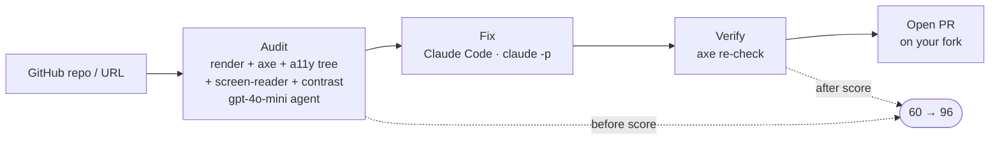

# Ramp

**Accessibility audit → fix → PR. axe detects; Ramp understands and fixes.**

Lighthouse and axe-core *find* WCAG violations and stop at a report. Ramp closes the loop:
it audits a real rendered page, reasons about the WCAG criterion, **writes the fix, verifies
it with axe-core, and opens a merge-ready pull request** — and it catches semantic issues axe
is blind to (alt text that just says `"image"`, links that say `"click here"`).

> **axe: 0 violations · Ramp: 12 semantic issues axe can't see** (across 3 demo pages).
>
> **Detection that depends on rendering:** on pages whose contrast lives in external CSS,
> the harness catches **92%** of violations vs **40%** reading source only (gpt-4o-mini, 3-run avg).

---

## Three pillars

| Pillar | Package | What it does |
|---|---|---|
| **A11y-Bench** | `packages/bench` | 51 tasks curated from real merged a11y fix-PRs (base→fix commits, hand-annotated) **+** 18 authored eval fixtures with gold annotations and decoys for a fair naked-vs-harness comparison. |
| **Harness** | `packages/harness` | Drives a headless page through Playwright + axe-core + accessibility tree + screen-reader simulation + contrast/focus inspectors + **semantic review**; an LLM agent reasons over the evidence (`runAudit`). |
| **Auto-fix loop** | `packages/control-plane` | sandbox checkout → audit → **Claude Code** fix → **axe verify (before/after score)** → **GitHub PR**. Sentry monitors every step. |

## Architecture



*Every step is traced in **Sentry**. Packages behind the steps: `harness` = Audit · `control-plane` = sandbox / Fix / Verify / PR + HTTP API + Sentry · `scoring` = score · `shared` = SQLite (`runs` · `findings` · `scores`).*

## Real fix PRs (verified, before → after)

| Repo | Fix | Score | PR |
|---|---|---|---|
| `bad.html` (fixture) | alt + contrast + button names + `<main>` | **60 → 96** | [Ramp#7](https://github.com/yangzhang75/Ramp/pull/7) |
| semantic (fixture) | meaningless alt/link/button names axe passes | semantic 5 → 0 | [Ramp#10](https://github.com/yangzhang75/Ramp/pull/10) |
| `aigov-ops…` (real OSS) | missing `<main>` landmark | **92 → 100** | [PR#1](https://github.com/yangzhang75/aigov-ops-open-source-vendor-rfi-rapp-johnston-june-2026/pull/1) |
| `caelaria` (real OSS) | unlabeled `<select>` controls | **84 → 92** | [PR#1](https://github.com/yangzhang75/caelaria/pull/1) |
| `Whatifarcade` (real OSS) | form label + `<main>` landmark | **96 → 100** | [PR#1](https://github.com/yangzhang75/Whatifarcade/pull/1) |
| `modulimo-home` (real OSS · via `fix:url`) | landmarks via `<main>` | **92 → 96** | [PR#2](https://github.com/yangzhang75/modulimo-home/pull/2) |

*PRs are opened on a fork (or your own repo) — Ramp fixes the real page without spamming upstream maintainers.*

## Benchmark (how the numbers are measured)

The fair detection comparison runs on **authored eval fixtures**, not the mined single-PR tasks — single-PR grading penalizes a thorough audit (a model that finds *every* real issue is marked "wrong" for anything outside that one PR's diff). The fixtures have complete gold annotations **plus accessible decoys**, so over-reporting is penalized. Figures are pooled (micro-average) over **3 runs** of `gpt-4o-mini`. *naked* sees only the page HTML; *harness* opens the rendered page.

| Suite | Pages | naked recall | harness recall |
|---|---|---|---|
| **Render-dependent** (contrast in external CSS) | 8 | 40.3% | **91.7%** |
| Inline-CSS baseline (colors in the HTML) | 10 | 90.6% | 79.2% |
| **Combined** | 18 | 69.0% | **84.5%** |

The edge shows up **exactly where rendering matters**: when contrast lives in external CSS, a source-reading model can't compute it (cascade, overrides, background blending) — the harness measures it with `check_contrast`. On the inline-CSS baseline the colors are in the HTML, so the two roughly tie. That's the honest story: **Ramp wins on what you can only see by rendering.**

Reproduce: `HL_RUNS=3 pnpm --filter @ramp/bench score:html-live` (full split) · `pnpm --filter @ramp/bench score:fixtures` (precision on annotated pages).

## Setup

**Requirements**
- **Node 20+** and **pnpm** — `pnpm install`
- **`OPENAI_API_KEY`** — runs the audit (`gpt-4o-mini`, ~pennies per page). Get one at <https://platform.openai.com/api-keys>.
- **`GITHUB_TOKEN`** — used to fork the target repo and open the PR. Classic token with the **`repo`** scope, or a fine-grained token with **Contents + Pull requests: Read/Write**. Create at <https://github.com/settings/tokens>.
- **Claude Code, logged in** — the *fix* step shells out to `claude -p`. It uses your **Claude Code quota, not an API key**. Install: <https://claude.com/claude-code>.

**Pass the keys per run** (inline — never commit them):
```bash
OPENAI_API_KEY=sk-...  GITHUB_TOKEN=ghp_...  \
  REPO_URL=https://github.com/owner/repo \
  pnpm --filter @ramp/control-plane fix:url
```

**Notes**
- `fix:demo` needs **no OpenAI key** (it scores with axe and fixes with Claude Code).
- The fork and the PR land in **your own account** — whoever owns `GITHUB_TOKEN`. Your repo → it edits directly; someone else's → it forks to you first.
- `fix:url` only handles **static HTML**; it refuses build-type repos (React/Vue/etc.) with a clear message.

## Quick start

```bash
pnpm install

# 1. Self-contained demo — repair bad.html and score it (no OpenAI key needed)
pnpm --filter @ramp/control-plane fix:demo                    # 60 → 96

# 2. Detection benchmark — naked LLM vs harness, recall + precision
HL_RUNS=3 pnpm --filter @ramp/bench score:html-live           # needs OPENAI_API_KEY

# 3a. Preset real-repo fix loop — fork → audit → fix → verify → open PR
TASK_ID=ramp-048 pnpm --filter @ramp/control-plane fix:repo   # needs OPENAI_API_KEY + GITHUB_TOKEN

# 3b. ANY static-HTML repo (bring your own creds) — forks to YOUR account, opens the PR there
REPO_URL=https://github.com/owner/repo \
  pnpm --filter @ramp/control-plane fix:url                   # needs OPENAI_API_KEY + GITHUB_TOKEN

# 4. Web UI (landing + demo dashboard)
pnpm dev:control-plane     # :8787 — API (Live Run / benchmark tabs)
pnpm dev:dashboard         # :5173 — Home + axe vs Ramp · Auto-fix · Scores · Live Run
```

## Tech stack

Playwright · axe-core · Vercel AI SDK (`ai` + `@ai-sdk/openai`, gpt-4o-mini) ·
Claude Code (`claude -p`, headless fixer) · Drizzle ORM + SQLite · React + Vite ·
Sentry · Octokit · `node:http` · TypeScript + pnpm workspaces.

## Monorepo layout

| Path | Role |
|---|---|
| `packages/shared` | Types · Drizzle schema · DB client |
| `packages/harness` | Audit tools + `runAudit` agent + semantic review |
| `packages/scoring` | Recall/precision metrics + leaderboard |
| `packages/bench` | A11y-Bench tasks + fixtures + miners/curators |
| `packages/control-plane` | HTTP API + fix loop + GitHub PRs + Sentry |
| `apps/dashboard` | React + Vite site: **Home** (product landing) + interactive demo tabs |

---

*Detect → Score → Fix → Validate → Pull Request. The artifact isn't a report — it's a reviewable PR.*
